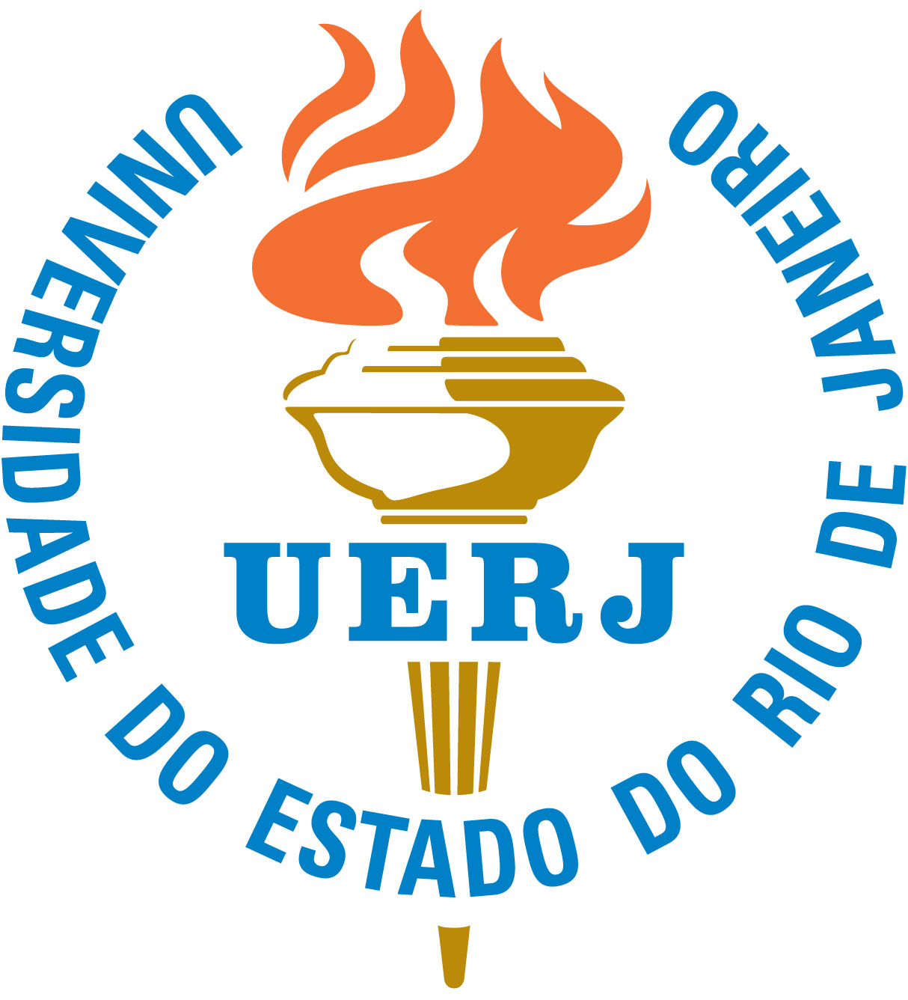

**STONEHENGE - Suite for Nonlinear Analysis of Energy Harvesting Systems** is an ensemble of easy-to-run Matlab and C++ codes for the nonlinear dynamic analysis of vibration energy harvesting systems. It encompasses several tools to simulate, optimize, control, and visualize their dynamics, providing a broad and robust framework for numerical experimentation.

## Table of Contents
- [Overview](#overview)
- [Features](#features)
- [Usage](#usage)
- [Documentation](#documentation)
- [Reproducibility](#reproducibility)
- [Authors](#authors)
- [Citing STONEHENGE](#citing-stonehenge)
- [License](#license)
- [Institutional Support](#institutional-support)
- [Funding](#funding)
- [Contact](#contact)
- [References using STONEHENGE](#references-using-stonehenge)

## Overview
**STONEHENGE** was developed to conduct nonlinear analysis on bistable piezoelectric-magneto-elastic energy harvesters. The code functionalities are reported in the following publication:
- **J. P. Norenberg, J. V. L. L. Peterson, V. G. Lopes, R. Luo, L. de la Roca, M. Pereira, J. G. Telles Ribeiro, A. Cunha Jr**, *STONEHENGE - Suite for Nonlinear Analysis of Energy Harvesting Systems*, Software Impacts, vol. 10, pp. 100161, 2021.

## Features
- Comprehensive nonlinear dynamic analysis of energy harvesting systems
- Simulation, optimization, control, and visualization tools
- Robust framework for numerical experimentation
- Fully reproducible simulations

## Usage
To get started with **STONEHENGE**, follow these steps:
1. Clone the repository:
   ```bash
   git clone https://github.com/yourusername/STONEHENGE.git
   ```
2. Navigate to the package directory:
   ```bash
   cd STONEHENGE/STONEHENGE-1.0
   ```

**STONEHENGE** can be used to simulate, optimize, control, and visualize the dynamics of bistable piezoelectric-magneto-elastic energy harvesters. Detailed usage instructions and examples are provided within the code comments and the provided documentation.

## Documentation
The routines in **STONEHENGE** are well-commented to explain their functionality. Each routine includes a description of its purpose, as well as inputs and outputs. Detailed documentation can be found within the code comments. An user-manual is available showing the package functionalities.

## Reproducibility
Simulations done with **STONEHENGE** are fully reproducible. You can find a fully reproducible capsule of the simulations on <a href="https://codeocean.com/capsule/4891890/tree/v1" target="_blank">CodeOcean</a>.

## Authors
- João Pedro C. V. Norenberg
- João Victor L. L. Peterson
- Vinicius G. Lopes
- Roberto Luo
- Leonardo de la Roca
- Marcelo Pereira
- José Geraldo Telles Ribeiro
- Americo Cunha Jr

## Citing STONEHENGE
If you use **STONEHENGE** in your research, please cite the following publication:
- *J. P. Norenberg, J. V. L. L. Peterson, V. G. Lopes, R. Luo, L. de la Roca, M. Pereira, J. G. Telles Ribeiro, A. Cunha Jr, STONEHENGE - Suite for Nonlinear Analysis of Energy Harvesting Systems, Software Impacts, 10:100161, 2021 http://dx.doi.org/10.1016/j.simpa.2021.100161*

```
@article{STONEHENGE2021,
   author       = {J. P. Norenberg and J. V. L. L. Peterson and V. G. Lopes and R. Luo and L. de la Roca and M. Pereira and J. G. {Telles Ribeiro} and A. Cunha Jr},
   title        = { {STONEHENGE} - {S}uite for {N}onlinear {A}nalysis of {E}nergy {H}arvesting {S}ystems},
   year         = {2021},
   journal      = {Software Impacts},
   volume.      = {10},
   pages        = {100161},
   note         = {http://dx.doi.org/10.1016/j.simpa.2021.100161},
}
```

## License

**STONEHENGE** is released under the MIT license. See the LICENSE file for details. All new contributions must be made under the MIT license.

 

## Institutional support

 &nbsp; &nbsp; 

## Funding

 &nbsp; &nbsp;  &nbsp; &nbsp; 

## Contact
For any questions or further information, please contact the authors at:

- João Pedro C. V. Norenberg: jpcvalese@gmail.com
- Americo Cunha Jr: americo.cunha@uerj.br

## References using STONEHENGE

The following references used STONEHENGE to obtain their results. If you want to see your publication listed here, please contact us.

- **J. P. Norenberg, and A. Cunha Jr**, *Vibration mitigation and energy harvesting with bistable resonators in metamaterial beams*, In: 27th International Congress on Mechanical Engineering (COBEM 2023), Florianópolis. Proceedings of COBEM 2023, 2023.

- **J. P. Norenberg, R. Luo, V. G. Lopes, J. V. L. L. Peterson, and A. Cunha**, *Nonlinear dynamics of asymmetric bistable energy harvesters*, International Journal of Mechanical Sciences, vol. 257, pp. 108542, 2023.

- **J. P. Norenberg, A. Cunha Jr, P. Wolszczak, and G. Litak**, *Piezomagnetic vibration energy harvester with an amplifier*, Theoretical & Applied Mechanics Letters, vol. 13, pp. 100478, 2023.

- **J. P. Norenberg, A. Cunha, S. da Silva, and P. S. Varoto**, *Probabilistic maps on bistable vibration energy harvesters*, Nonlinear Dynamics, vol. 111, pp. 20821-20840, 2023.

- **J. G. Telles Ribeiro, M. Pereira, A. Cunha Jr, and L. Lovisolo**, *Controlling chaos for energy harvesting via digital extended time-delay feedback*, European Physical Journal-Special Topics, vol. 231, pp. 1485-1490, 2022.

- **J. C. C. Basilio, T. R. Oliveira, J. G. Telles Ribeiro, and A. Cunha**, *Evaluation of Fractional-Order Sliding Mode Control Applied to an Energy Harvesting System*, In: 2022 16th International Workshop on Variable Structure Systems (VSS), Rio de Janeiro. 2022 16th International Workshop on Variable Structure Systems (VSS), 2022. pp. 243.

- **R. Luo, J. P. Norenberg, and A. Cunha Jr**, *Análise numérica num dispositivo coletor de energia assimétrico não linear*, In: Congresso Nacional de Estudantes de Engenharia Mecânica (CREEM 2022), Santa Maria. Anais do CREEM 2022, 2022.

- **A. Cunha, G. Litak, and P. Wolszczak**, *Effect of stochastic excitation on sub-harmonic solutions in a bistable energy harvester*, In: International Conference of Numerical Analysis and Applied Mathematics (ICNAAM 2020), 2022, Rhodes, 2020. vol. 2425. pp. 410003.

- **J. P. Norenberg, A. Cunha Jr, S. da Silva, and P. S. Varoto**, *Global sensitivity analysis of asymmetric energy harvesters*, Nonlinear Dynamics, vol. 109, pp. 443-458, 2022.

- **Canisso Valese Norenberg, João Pedro; Luo Yuan Cai, Roberto; Cunha Jr, Americo; da Silva, Samuel; Varoto, Paulo**, *Remarks on the dynamic behavior of an asymmetric bistable energy harvester*, In: 26th International Congress of Mechanical Engineering, 2021, Florianópolis. Proceedings of the 26th International Congress of Mechanical Engineering, 2021.

- **A. Cunha Jr**, *Enhancing the performance of a bistable energy harvesting device via the cross-entropy method*, Nonlinear Dynamics (Dordrecht. Online), vol. 103, pp. 137-155, 2021.

- **J. P. Norenberg, J. V. L. L. Peterson, V. G. Lopes, R. Luo, L. de la Roca, M. Pereira, J. G. Telles Ribeiro, and A. Cunha Jr**, *STONEHENGE - Suite for Nonlinear Analysis of Energy Harvesting Systems*, Software Impacts, vol. 10, pp. 100161, 2021.

- **V. G. Lopes, J. V. L. L. Peterson, and A. Cunha Jr**, *The nonlinear dynamics of a bistable energy harvesting system with colored noise disturbances*, Journal of Computational Interdisciplinary Sciences, vol. 10, pp. 125, 2019.

- **V. Lopes, J. V. L. L. Peterson, and A. Cunha Jr**, *Nonlinear characterization of a bistable energy harvester dynamical system*, Topics in Nonlinear Mechanics and Physics: Selected Papers from CSNDD 2018, Editor: M. Belhaq, Springer Singapore, pp. 71-88, 2019.

- **L. de la Roca, J. Peterson, M. Pereira, and A. Cunha Jr**, *Control of chaos via OGY method on a bistable energy harvester*, In: 25th ABCM International Congress of Mechanical Engineering (COBEM 2019), Uberlândia, Brazil, 2019.

- **V. Lopes, J. V. L. L. Peterson, and A. Cunha Jr**, *On the nonlinear dynamics of a bi-stable piezoelectric energy harvesting device*, In: 24th ABCM International Congress of Mechanical Engineering (COBEM 2017), Curitiba, Brazil, 2017.

- **V. Lopes, J. V. L. L. Peterson, and A. Cunha Jr**, *Numerical study of parameters influence over the dynamics of a piezo-magneto-elastic energy harvesting device*, In: XXXVII Congresso Nacional de Matemática Aplicada e Computacional (CNMAC 2017), São José dos Campos, Brazil, 2017.

- **J. V. L. L. Peterson, V. Lopes, and A. Cunha Jr**, *Maximization of the electrical power generated by a piezo-magneto-elastic energy harvesting device*, In: XXXVI Congresso Nacional de Matemática Aplicada e Computacional (CNMAC 2016), Gramado, Brazil, 2016.
